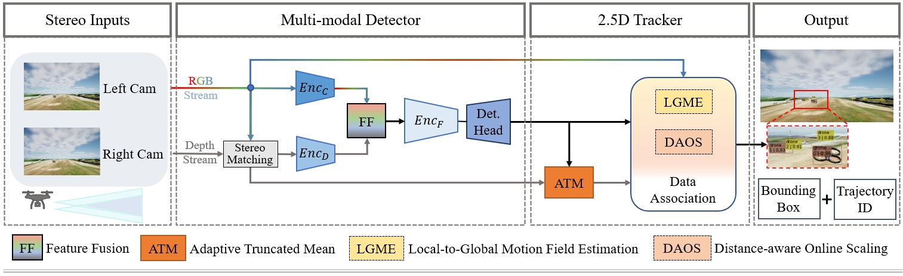
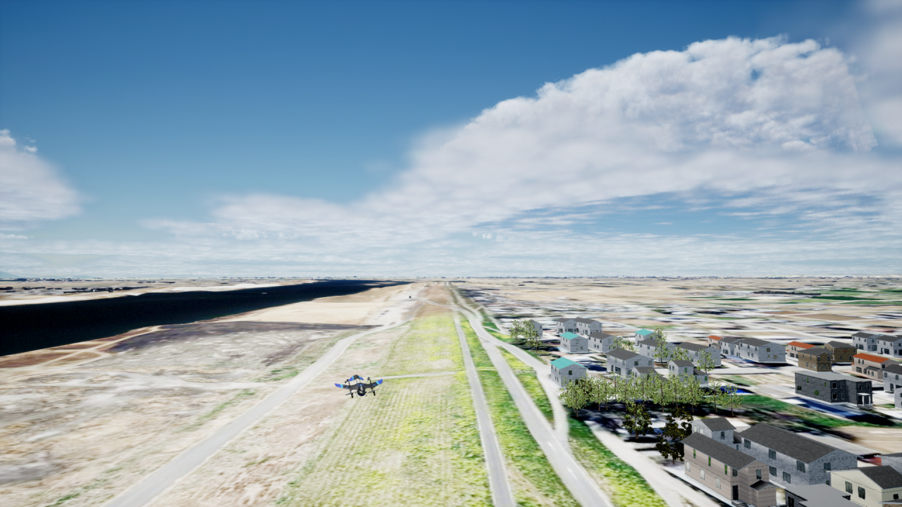
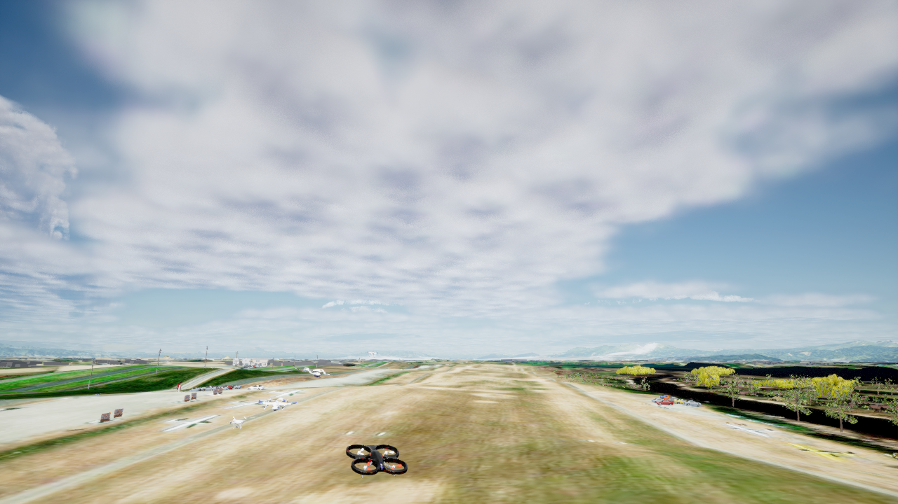
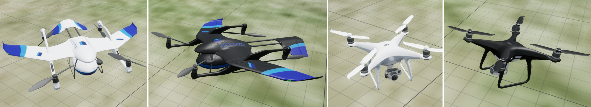
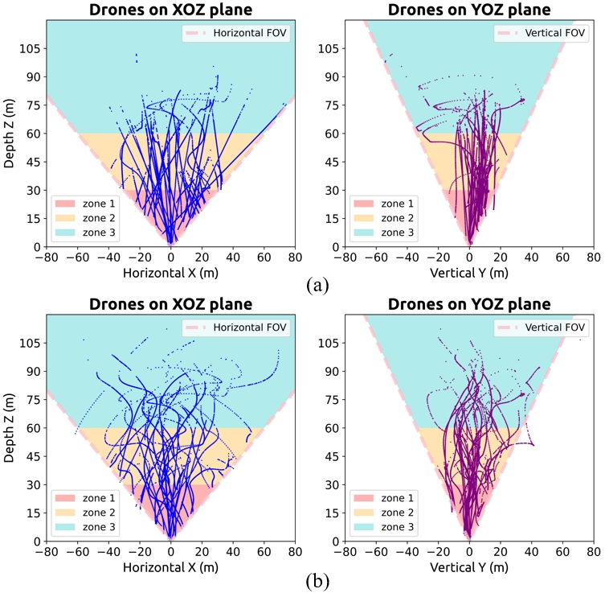

## StereoTracking
This repository is an implementation of the StereoTracking presented in the paper "Drone-based Depth-Aware Airborne Object Detection and Tracking"

Our code is based on the [mmTracking](https://github.com/open-mmlab/mmtracking/tree/1.x).

## Introduction
we present StereoTracking, a novel detection-based tracking framework specifically designed to enhance the perception and tracking of airborne targets by leveraging depth cues from stereo vision systems. The key components includes a Multi-modal Detector, Local-to-Global Motion Field Estimation, Adaptive Truncated Mean (ATM), and Distance-aware Online Scaling (DAOS), which can be seamlessly integrate into existing tracking systems and work synergistically to enhance detection performance, compensate for camera motion, and adapt to varying target distances.

<div align="center">

</div>

## Installation
```shell
conda create -n stereoTracking python=3.9.0 pip=22.2.2
conda activate stereoTracking
# Install pytorch
conda install pytorch==1.13.1 torchvision==0.14.1 torchaudio==0.13.1 pytorch-cuda=11.7 -c pytorch -c nvidia
# Install MMEngine, MMCV, MMDet, MMYOLO. Be aware that this must be done _after_ installing PyTorch, otherwise openmim will skip the installation of some components.
pip install -U openmim
mim install "mmengine==0.10.3" "mmcls==1.0.0rc4" "mmcv==2.0.0rc3" "mmdet==3.0.0rc4" "mmyolo==0.2.0"
# Clone the repository
git clone https://github.com/Superjie13/StereoTracking.git
cd StereoTracking
# Install build requirements and build StereoTracking
  pip install -r requirements/build.txt
  pip install -v -e .  # or "python setup.py develop"
# For MOT Evaluation
pip install git+https://github.com/JonathonLuiten/TrackEval.git
```
### Environment
- Ubuntu 20.04
- Python 3.9
- PyTorch 1.13.1
- GPU RTX 4090 (24G)

## AirSim-Drone Dataset
<div align="center">
<p float="left">
  
  
</p>
</div>

<div align="center">

</div>

Please download our dataset from the link below, unzip the left/right nested zips, and and build a soft link to the data folder.
- Sample of 1 sequence: [download (1.6 GB)](https://airdrone.s3.ap-northeast-1.amazonaws.com/airdrone_sample.zip)
- Video previews of all sequences: [download (330 MB)](https://airdrone.s3.ap-northeast-1.amazonaws.com/airdrone_previews.zip)
- Full dataset, 64 sequences: [download (141 GB)](https://airdrone.s3.ap-northeast-1.amazonaws.com/airdrone_full.zip)

### Annotation
Annotation format is similar to MOT-Challenge: 
`frame_id, id, x, y, w, h, confidence, X, Y, Z, class`
  - frame_id: frame number
  - id: object id
  - x, y, w, h: bounding box coordinates
  - confidence: detection confidence
  - X, Y, Z: 3D location of the object
  - class: object class

We provide the coco-style annotation in the `annotations` folder for simple usage.
```shell
mkdir data
ln -s /path/to/your/dataset data/
```

### Data Structure
```
data
├── AirSim_drone
│   ├── annotations
│   |  ├── train_cocoformat_[xx].json
│   |  ├── val_cocoformat_[xx].json
│   |  |── ...
│   ├── train
|   |  ├── video_sequence
|   |  |  ├── depth
|   |  |  ├── disparity
|   |  |  ├── left
|   |  |  ├── right
|   |  |  ├── ...
│   |  |── ...
│   ├── val
|   |  ├── video_sequence
|   |  |  ├── depth
|   |  |  ├── disparity
|   |  |  ├── left
|   |  |  ├── right
|   |  |  ├── ...
```

### Position Statistics
We provide the position statistics of training and validation set in our AirSim-Drone dataset. 

<div align="center">

</div> 

## Testing
To test the StereoTracking on the AirSim-Drone dataset, download the pretrained model from [here](https://drive.google.com/file/d/1-GanvZtTk11YQpa_lg4sBjHiKLdSSZDB/view?usp=drive_link) and run the following command:
```shell

python tools/test.py \
  configs/stereo_tracking/ocsort/yolox_s_mmyolo_mot_airsim_drone_disp.py \
  --checkpoint [path/to/checkpoint] \
  --work-dir [path/to/your/workdir]
```

## Training
```shell
python tools/train.py \
configs/stereo_tracking/ocsort/yolox_s_mmyolo_mot_airsim_drone_disp.py \
--work-dir [path/to/your/workdir]
```

## Export to ONNX
To convert the StereoTracking model to ONNX, you can refer to [ONNX Model Export](https://github.com/Superjie13/YOLOX-Deploy-Test---multi-modal-inputs/tree/master#onnx-model-export) in the `YOLOX-Deploy-Test---multi-modal-inputs` repository.

Note: StereoTracking model is trained with the 'mmtracking' framework, to export the detection model, you need to first extract the 'detector' part from the model and then export it to ONNX.

## A toy video from `Drone-vs-Bird` dataset.
To show the effectiveness of our methods even without depth information, i.e., only leveraging our LGME. We provide a toy video from the [`drone-vs-bird`](https://github.com/wosdetc/challenge) dataset. 

https://github.com/user-attachments/assets/b57d0d8a-2410-4195-a777-edfe0d42495c
